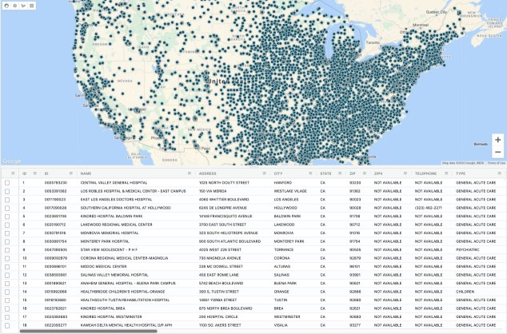

<h1 align="center">Table & Map - Visualize your location data</h1>

<p align="center">
  <a href="https://app.netlify.com/sites/tableandmap/deploys" target="_blank">
    
  </a>
  <a href="https://app.netlify.com/sites/tableandmap-storybook/deploys" target="_blank">
    
  </a>
</p>

<p align="center">
  
  
  
  
  
<p>
  
[Table & Map](https://tableandmap.com) provides a quick and easy solution for viewing location data on a map. Drag and drop any excel or csv file with addresses or latitudes and longitudes and instantly see where the data falls without any tedious setup.




## Project setup
```
npm install
```

### Compiles and hot-reloads for development
```
npm run serve
npm run lambda-serve
npm run storybook
```

### Compiles and minifies for production
```
npm run build -- --mode prod
```

### Lints and fixes files
```
npm run lint
```

ag-grid-community
eslint
sass-loader